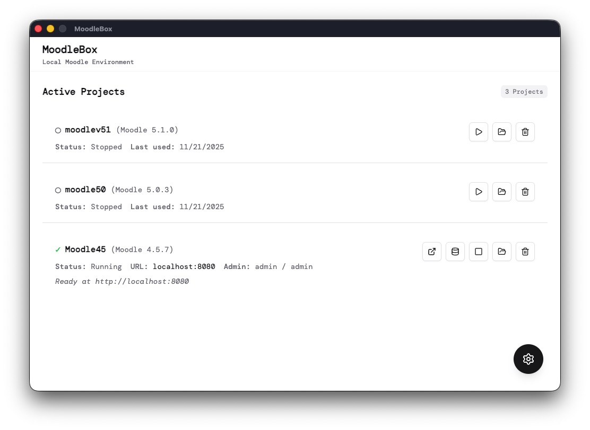

# MoodleBox

<div align="center">


**A local Moodle environment for everyone**

</div>

---

## 📸 Screenshots



---

## 🎯 Overview

**MoodleBox** is a cross-platform desktop application that simplifies local Moodle development environments. Set up a complete Moodle environment in under 5 minutes with zero Docker knowledge required.

---

## 📦 Prerequisites

- **Docker Desktop** (20.10+) - [Download](https://www.docker.com/products/docker-desktop)
- Ensure Docker is running before launching MoodleBox

---

## 🚀 Installation & Usage

### Option 1: Download Pre-built Release (Recommended)

Download the latest release for your platform:

- **Windows**: `moodlebox-{version}-setup.exe`
- **macOS**: `moodlebox-{version}.dmg`
- **Linux**: `moodlebox-{version}.AppImage` or `.deb`

#### ⚠️ macOS Warning: Unsigned App

MoodleBox is currently **unsigned** and may be blocked by macOS Gatekeeper. If you see "MoodleBox is damaged" error:

**Solution 1: Use Fix Script (Easiest)**

```bash
# Download and run the fix script:
curl -O https://raw.githubusercontent.com/yourusername/ezadevbox/main/fix-macos-quarantine.sh
chmod +x fix-macos-quarantine.sh
./fix-macos-quarantine.sh
```

**Solution 2: Manual Command**

```bash
# After downloading the .dmg file, run this in Terminal:
xattr -cr ~/Downloads/moodlebox-*.dmg

# Then open the DMG normally
```

**Solution 3: After Installation**

1. Try to open the `.dmg` file (you'll see the "damaged" error)
2. Open **Terminal** and run:
   ```bash
   xattr -cr /Applications/MoodleBox.app
   ```
3. Now launch MoodleBox from Applications

**Solution 4: System Settings**

1. Try to open MoodleBox
2. Go to **System Settings → Privacy & Security**
3. Click **Open Anyway** next to the blocked app message

After opening once, macOS will remember your choice and allow future launches.

### Option 2: Build from Source

```bash
# Clone the repository
git clone https://github.com/yourusername/ezadevbox.git
cd ezadevbox

# Install dependencies
npm install

# Regenerate icons (if updating icon design)
npm run icons

# Build for your platform
npm run build:win   # Windows
npm run build:mac   # macOS
npm run build:linux # Linux
```

Built applications are located in the `dist/` directory.

#### 🔧 Troubleshooting: Icon Not Updating

If the app icon doesn't update after rebuilding:

1. **Regenerate icons**:

   ```bash
   npm run icons
   ```

   This generates `build/icon-source.png` and then creates platform-specific icons.

2. **Clear Electron Builder cache**:

   ```bash
   # macOS/Linux
   npm run clean:cache

   # Windows
   npm run clean:cache:win
   ```

   Or manually delete:
   - **macOS**: `~/Library/Caches/electron-builder`
   - **Linux**: `~/.cache/electron-builder`
   - **Windows**: `%USERPROFILE%\AppData\Local\electron-builder`

3. **Rebuild**:
   ```bash
   npm run build:mac  # or build:win/build:linux
   ```

The icon files are located in `build/`:

- `icon.icns` - macOS (required)
- `icon.ico` - Windows (required)
- `icon.png` - Linux (required)
- `icon-source.png` - Source image (1024x1024 PNG)

---

## ⚡ Quick Start

1. **Ensure Docker Desktop is running**
2. **Launch MoodleBox**
3. **Click "Add Project"** (+ icon)
4. **Enter project name** and select Moodle version
5. **Click "Create Project"** and wait ~3-5 minutes
6. **Click "Open Moodle"** when status shows "Ready"
7. **Login** with default credentials:
   - Username: `admin`
   - Password: `admin`

---

## 🛠️ Development

### Prerequisites

- Node.js 18+ (LTS recommended)
- Docker Desktop running

### Setup

```bash
# Install dependencies
npm install

# Run type checking
npm run typecheck

# Run linter
npm run lint

# Format code
npm run format
```

### Build Commands

```bash
npm run build        # Build for all platforms
npm run build:win    # Windows only
npm run build:mac    # macOS only
npm run build:linux  # Linux only
npm run build:unpack # Unpacked directory (faster for testing)
```

---

## 📖 Usage

### Managing Projects

- **Start**: Click Play button (▶) on project card
- **Stop**: Click Stop button (■) on project card
- **Delete**: Click Delete button (🗑) - removes all project files and containers
- **Open Moodle**: Launches Moodle site in browser
- **Open phpMyAdmin**: Launches database management tool
- **Open Folder**: Opens project directory in file explorer

### Project States

| State        | Description           | Action   |
| ------------ | --------------------- | -------- |
| **Ready**    | Fully operational     | Use it!  |
| **Starting** | Containers booting up | Wait     |
| **Stopped**  | Containers halted     | Start it |
| **Error**    | Something went wrong  | Check it |

---

## 🐛 Troubleshooting

### Docker Not Running

**Error**: "Docker is not running"

**Solution**: Launch Docker Desktop and wait for it to fully start, then retry.

### Port Already in Use

**Error**: "Port 8080 is already in use"

**Solution**: Stop the conflicting service or choose a different port when creating a project.

### Project Stuck Installing

**Solution**:

- Check Docker Desktop has sufficient resources (4GB+ RAM)
- Check internet connection (Moodle downloads are 100-200MB+)
- View project logs for detailed error messages

### macOS App Blocked

If macOS blocks the app:

1. Right-click the app → **Open**
2. Or go to **System Settings → Privacy & Security** → **Open Anyway**
3. After first launch, future launches will work normally
